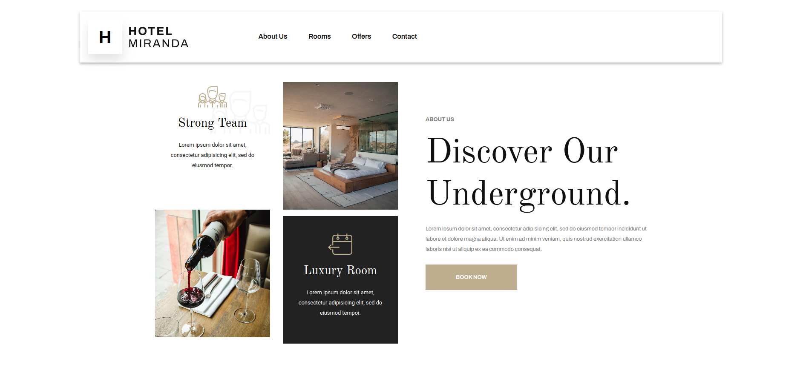
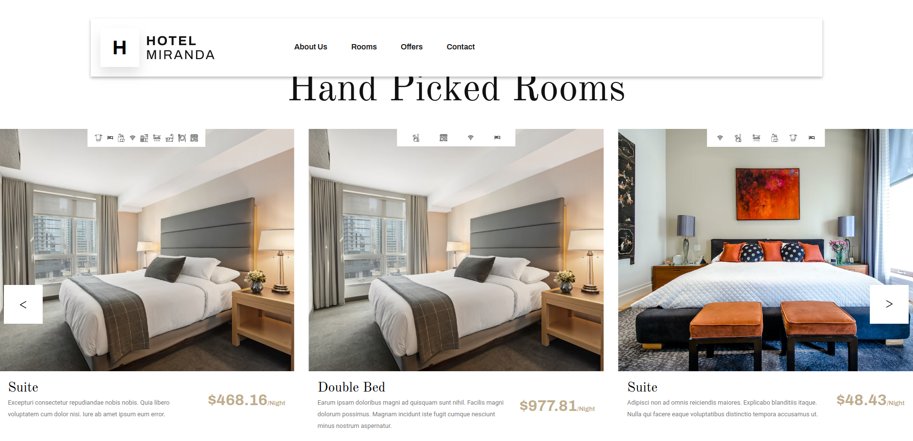

# Hotel Miranda Laravel #

Miranda hotel website with docker and laravel.

## Installation ##

- Clone this repository.

```bash
git clone https://github.com/JoseFerAlvarez/hotel-miranda-laravel.git
```

- Follow this [tutorial](https://devmarketer.io/learn/setup-laravel-project-cloned-github-com/).

## Links to the Miranda's projects ##

- Link to [hotel-miranda-php](https://github.com/JoseFerAlvarez/hotel-miranda-php).

- Link to [hotel-miranda-laravel](https://github.com/JoseFerAlvarez/hotel-miranda-laravel).

- Link to [hotel-miranda-design](https://github.com/JoseFerAlvarez/hotel-miranda-design).

- Link to [hotel-miranda-dashboard](https://github.com/JoseFerAlvarez/hotel-miranda-dashboard).

- Link to [hotel-miranda-back](https://github.com/JoseFerAlvarez/hotel-miranda-back).

## Technologies used ##

<p align="center">


</p>

## Web View ##



